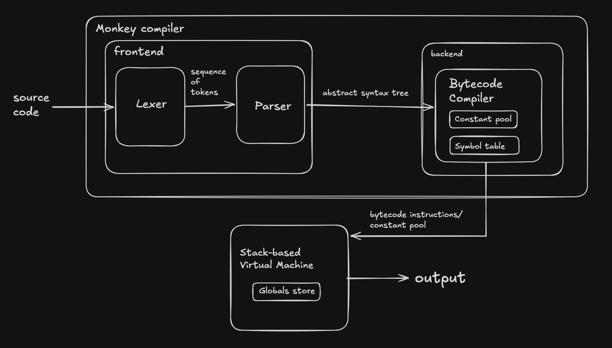

# Monkey Compiler

[DEMO](https://mannyns.dev/compiler), there is now a working demo for this project on my personal site, check it out!

Monkey-Compiler is an implementation of the compiler for the *Monkey Programming Language* by Thorsten Ball, with a bit of added features.

*Monkey* supports all basic data types and constructs, with some personally fascinating additions:  
- integer
- boolean
- string
- prefix/infix operators
- conditionals
- *first-class functions*  
and many more!

## Architecture



## Status

Monkey-Compiler includes:  
  
**finished**
- lexer  
- parser  
- abstract syntax tree (AST)
- object system  
  
**ongoing**
- bytecode definition
- virtual machine
- compiler

## CURRENT STATE:
Compiler frontend can parse all data types, including function literals, and call expressions.  
Compiler backend cannot yet compile function literal and call expression nodes to bytecode, and virtual machine therefore cannot execute anything involving these data types.

## Technical Highlights

**Parser**: Implements pratt parsing, highly efficient precedence-based parsing algorithm for expressions.  
**Idiomatic Go**: Using (at least trying to) modern Go patterns, especially utilizing Go's amazing testing package.  
**Stack-Based VM**: Currently building a custom virtual machine, more to come soon...  

## Usage
example of *Monkey* code:  
```
let a = 5;
let b = if (5 < 4) { a } else { 0 };
let add = fn(x, y) { x + y };
let c = add(a, b);
```

## Reason for Monkey!
After building my [interpreter](https://github.com/mannyjimen/Mini-Compiler) in C++, I was left wanting more. Compilers have always sounded like something very complex and difficult, but isn't everything in life? If I can say I have built a compiler, that is something I would be proud of. Seeing something come alive from nothing is what made me love building my interpreter, and managing to build a compiler pushes my passion further!

## Sources
[Writing an Interpreter in Go](https://interpreterbook.com/) by Thorsten Ball  
[Writing a Compiler in Go](https://compilerbook.com/) by Thorsten Ball